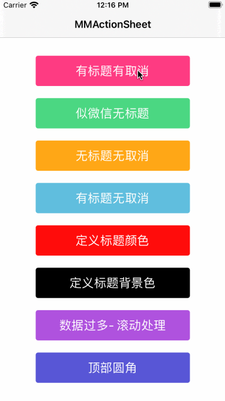
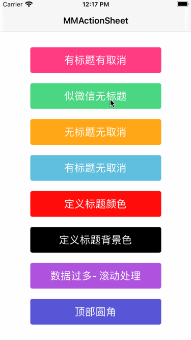

## MMActionSheet


[](https://cocoapods.org/pods/MMActionSheet) 
[](https://cocoapods.org/pods/MMActionSheet) 
[](https://github.com/MinMao-Hub/MMActionSheet)
[](http://opensource.org/licenses/MIT)

### Introduction

MMActionSheet 是一个简单的弹出选择框，使用纯swift编写，类似于微信的actionsheet

MMActionSheet is an simple pop-up selection box(ActionSheet) written in pure Swift. Similar to the wechat actionsheet

### Rquirements

* iOS 8.0+
* Xcode 9 (swift 4)
* Xcode 8 (swift 3) 
	* If you want to run demo in swift3, please switch branch to swift3.0

### Installation


#### Install with  Cocoapods

* `pod 'MMActionSheet', '~> 1.0'`
* `import MMActionSheet `  in you code


#### Copy code into project

[克隆代码](https://github.com/MinMao-Hub/MMActionSheet.git)，然后将components文件夹下面的两个文件 `MMActionSheet.swift` 和 `MMButton.swift`加入到你的项目中即可。	

Just clone and add `MMActionSheet.swift`, `MMButton.swift` to your project.

### Example

> 1. ***has "Cancel" buttons and titles【有标题有取消按钮】***
> 
> 2. ***has a "Cancel" button but no title【无标题有取消按钮(类似于微信)】***
> 
> 3. ***no "Cancel" button and no title【无标题无取消按钮】***
> 
> 4. ***has a title but no "Cancel" button【有标题无取消按钮】***
> 5. ***Defines the title color【定义标题颜色】*** 
>>目前仅支持三种(`default`,`blue`,`danger`)

<div>
	
	
	
</div>
<div style="margin-top: 30px">
	
	
</div>


### Usage

```swift
let buttons = [
    [
        "title": "拍照",
        "handler": "camera",
    ],[
        "title": "相册",
        "handler": "photos",
        "type": "default"
    ]
] 
let cancelBtn = [
    "title": "取消",
]
let mmActionSheet = MMActionSheet.init(title: "请选择照片", buttons: buttons, duration: nil, cancelBtn: cancelBtn)
mmActionSheet.callBack = { (handler) ->() in
    print(handler)
}
mmActionSheet.present()

```

*PS:注释*

* create actionsheet && init 【创建并初始化】

`MMActionSheet.init(title: "请选择照片", buttons: buttons, duration: nil, cancelBtn: cancelBtn)`

* argument【参数描述】
 
	* `title` 头部标题
	* `buttons` 事件按钮数组，类型为`Array<Dictionary<String, String>>`，里面包含每一个按钮的具体属性：
		
		```
		[
	        "title": "拍照",
	        "handler": "camera",
	        "type": "default"
	    ]
		```
		* `title`   按钮标题
		* `handler` 按钮事件唯一标识，回调的时候根据该值区别处理事件
		* `type`    按钮类型（展示不同的标题颜色）【`default`,`blue`,`danger`】
	* `duration ` 动画时长
	* `cancelBtn `   取消按钮属性，属性跟上述buttons内部button属性一致；若设置为`nil`则无该按钮, 必须要设置某一个属性，默认值为`[
    "title": "取消", "handler": "cancel","type": "default"]`
* callback【回调】

```
mmActionSheet.callBack = { (handler) ->() in
	print(handler)
}
```
 `handler` 该handler即为buttons里面button的`handler`，对应的回调过来

* present【弹出actionsheet】

`mmActionSheet.present()`


### Contribution

You are welcome to fork and submit pull requests.

### License

MMActionSheet is open-sourced software licensed under the MIT license.
