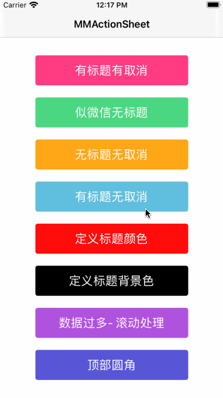
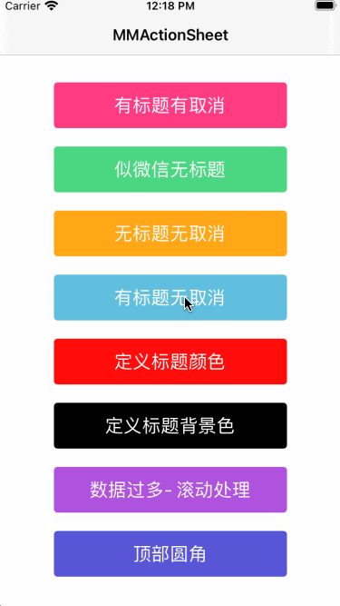

</img>

[](https://cocoapods.org/pods/MMActionSheet) 
[](https://github.com/MinMao-Hub/MMActionSheet)
[](https://cocoapods.org/pods/MMActionSheet) 
[](https://github.com/MinMao-Hub/MMActionSheet)
[](http://opensource.org/licenses/MIT)

### Introduction

MMActionSheet 是一个简单的弹出选择框，使用纯swift编写，类似于微信的actionsheet

MMActionSheet is an simple pop-up selection box(ActionSheet) written in pure Swift. Similar to the wechat actionsheet

### Rquirements

* iOS 8.0+
* Xcode 11+ (swift 4.0、swift 4.2、swift5.0)


### Installation


#### Install with  Cocoapods

* `pod 'MMActionSheet', '~> 1.0.4'`
* `import MMActionSheet `  in you code


#### Copy code into project

[克隆代码](https://github.com/MinMao-Hub/MMActionSheet.git)，然后将components文件夹下面的所有文件加入到你的项目中即可。	

Just clone and add components dir to your project.

### Example

|描述|预览|
|:--:|:--:|
|Has `Cancel` buttons and `Title`<br>【有标题和取消按钮】||
|Has a `Cancel` button but no `Title`<br>【无标题有取消按钮】||
|No `Cancel` button and no `Title`<br>【无标题无取消按钮】||
|Has a `Title` but no `Cancel` button<br>【有标题无取消按钮】||
|Customize text color<br>【自定义文本颜色】||
|Customize title background color, etc<br>【自定义背景色、选中背景色等】||
|Multi data scrolling<br>【多数据滚动】||
|Set top CornerRadius<br>【设置顶部圆角】||


### Usage

```swift
let buttons = [
	MMButtonItem(title: "拍照", titleColor: .default, buttonType: .default(index: 0)),
	MMButtonItem(title: "相册", titleColor: .default, buttonType: .default(index: 1)),
]

let titleItem = MMTitleItem(title: "请选择照片", titleColor: .red)
let cancelButton = MMButtonItem(title: "取消", titleColor: .default, buttonType: .cancel)

let mmActionSheet = MMActionSheet(title: titleItem, buttons: buttons, duration: nil, cancelButton: cancelButton)
mmActionSheet.selectionClosure = { item in
    if let currentItem = item, let type = currentItem.buttonType {
        switch type {
        case let .default(index):
            print("== default index \(index) ==")
        case .cancel:
            print("cancel")
        }
    }
}
mmActionSheet.present()

```

*PS:注释*

* create actionsheet && init 【创建并初始化】

`MMActionSheet(title: titleItem, buttons: buttons, duration: nil, cancelButton: cancelButton)`

* argument【参数描述】
 
	* `title` 头部标题,类型为 `MMTitleItem `
	* `buttons` 事件按钮数组，类型为`Array<MMButtonItem>`，里面包含每一个按钮的具体属性：
		
		```
		public var title: String?
		public var titleColor: MMButtonTitleColor? = .default
		public var titleFont: UIFont? = .systemFont(ofSize: 16.0)
		public var buttonType: MMButtonType?
		public var backgroudImageColorNormal: MMButtonTitleColor? = .custom(MMTools.DefaultColor.normalColor)
		public var backgroudImageColorHighlight: MMButtonTitleColor? = .custom(MMTools.DefaultColor.highlightColor)
		```
		* `title`   按钮标题
		* `titleColor ` 按钮颜色
		* `titleFont ` 按钮字体
		* `type`    按钮类型（展示不同的标题颜色）【枚举类型 - `default`,`blue`,`danger`, `custom`】
		* `backgroudImageColorNormal`   正常背景色
		* `backgroudImageColorHighlight`   选中背景色
	* `duration ` 动画时长
	* `cancelBtn `  取消按钮属性，属性跟上述buttons内部button属性一致；若设置为`nil`则不显示该按钮
* callback【回调】

```
mmActionSheet.selectionClosure = { item in
	if let currentItem = item, let type = currentItem.buttonType {
        switch type {
        case let .default(index):
            print("== default index \(index) ==")
        case .cancel:
            print("cancel")
        }
    }
}
```
 `item ` 该handler即为buttons里面的`MMButtonItem`，对应的回调过来

* present【弹出actionsheet】

`mmActionSheet.present()`


### Contribution

You are welcome to fork and submit pull requests.

### License

MMActionSheet is open-sourced software licensed under the MIT license.
